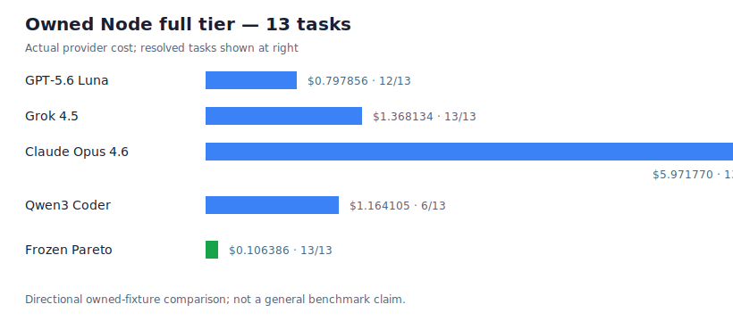

# Pareto Curve Agent Harness

A small research harness for comparing **coding-agent policies** by deterministic task outcome and actual provider cost.

The current study uses owned, dependency-free Node repair fixtures. It is **directional evidence**, not a public leaderboard or a claim about all software-engineering tasks.

## The ladder is the product

This harness compares **policies**, not just model names. Both policies start from the same fixture baseline and receive the same prompt, bounded tools, production-only patch boundary, deterministic `node --test` regression, fresh workspace, and provider-cost accounting. The policy—not the task contract—is what changes.

### Generic fixed-model harness

A generic harness gives one selected model a single continuous session of up to **72 model-response/tool-loop turns per task**. The model keeps its conversation context and any accepted workspace edits for that session. It either produces a passing regression, stops, hits a cap, or exhausts 72 turns. It does not change models or reset back to the original baseline mid-task.

### Frozen Pareto ladder

The Pareto harness turns that one long attempt into a controlled escalation loop:

1. It starts a clean workspace from the fixture baseline and dispatches the first model in the immutable nine-rung order.
2. A rung can use the same bounded tools and up to **8 turns** to inspect, patch production source, and run the exact regression.
3. If that regression passes and every provider call has valid `usage.cost`, the patch is accepted and the ladder stops.
4. Otherwise, the candidate patch is rejected, the workspace is reset to the original baseline, and compact failing-test feedback is carried forward.
5. The next model gets a fresh 8-turn attempt against that clean baseline. The process repeats until a rung resolves the task, cost accounting fails closed, a cap stops the run, or all nine rungs are exhausted.

The ladder therefore has at most **9 × 8 = 72 turns per task**, matching the generic policy's maximum response envelope. It intentionally does **not** have the same trajectory: generic grows one model's context, while Pareto buys isolated retries, model selection, and resettable failure recovery. Treat the results as evidence about complete policies—not a pure model-quality ranking.

## Cost study: evidence for the ladder

The latest full run evaluated 13 owned fixtures across four fixed models and the frozen Pareto policy. All 65 task-policy rows had complete provider-reported `usage.cost`. The cost table below is supporting evidence for the execution design above, not a claim that the listed prices or rankings generalize beyond this run.



| Policy | Resolved | Actual provider cost |
|---|---:|---:|
| GPT-5.6 Luna — one 72-turn session | 12 / 13 | $0.797856 |
| Grok 4.5 — one 72-turn session | 13 / 13 | $1.368134 |
| Claude Opus 4.6 — one 72-turn session | 13 / 13 | $5.971770 |
| Qwen3 Coder — one 72-turn session | 6 / 13 | $1.164105 |
| Frozen Pareto | 13 / 13 | $0.106386 |

On this single owned-fixture run, Pareto matched the strongest fixed-model resolution result at the lowest actual cost. That is a policy result for this suite—not a general model ranking.

The complete evidence is checked in:

- [full report](reports/full-model-matrix-001/REPORT.md)
- [cost chart](reports/full-model-matrix-001/cost-chart.svg)
- [CSV rows](reports/full-model-matrix-001/results.csv)
- [JSON rows](reports/full-model-matrix-001/results.json)
- [hash-bound run manifest](reports/full-model-matrix-001/run-manifest.json)

## Validate or run the current suite

The owned fixture tiers are `single` (1 task), `lite` (4 fast tasks), and `full` (13 tasks). Start with a no-cost validation run; the output directory must be new unless you use `--resume` with the exact same run manifest.

```bash
node scripts/run-owned-node-suite.mjs \
  --tier lite \
  --models openai/gpt-5.6-luna,x-ai/grok-4.5 \
  --generic-turns 72 \
  --include-pareto \
  --max-task-cost-usd 9 \
  --max-total-cost-usd 75 \
  --output-dir "/tmp/pareto-lite-dry-$(date +%s)" \
  --dry-run
```

See [documentation](docs/README.md) for command details, artifact contracts, the catalog CLI, legacy Docker ladder notes, and development instructions.
