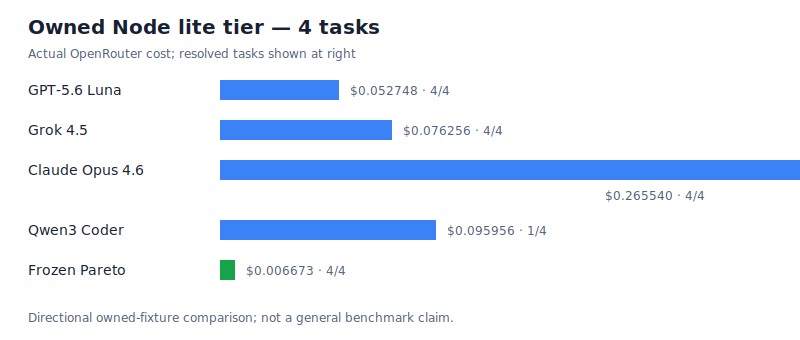

# Owned Node model matrix — tier: `lite` (4 tasks)

**Scope:** `config-numeric-attribute`, `http-utf8-content-length`, `url-query-repeat-empty-values`, `ndjson-chunk-framer`. Fixed models use one continuous 72-turn session; Pareto retains its immutable nine-rung policy with eight turns per rung. Every row below uses the same fixture baseline, prompt, tools, and regression.

| Policy | Resolved | Complete-cost rows | Actual provider cost |
|---|---:|---:|---:|
| `fixed:openai/gpt-5.6-luna` | 4 / 4 | 4 / 4 | $0.052748 |
| `fixed:x-ai/grok-4.5` | 4 / 4 | 4 / 4 | $0.076256 |
| `fixed:anthropic/claude-opus-4.6` | 4 / 4 | 4 / 4 | $0.265540 |
| `fixed:qwen/qwen3-coder` | 1 / 4 | 4 / 4 | $0.095956 |
| `pareto:frozen-nine-rung` | 4 / 4 | 4 / 4 | $0.006673 |

**Observed complete-cost spend:** $0.497173 (cap: $75.00). This is an owned-fixture directional study, not a general benchmark claim.
