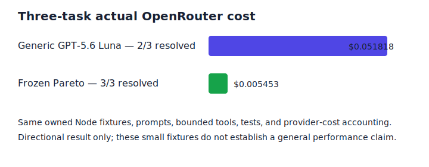

# Owned Node fixture comparison: generic baseline vs. Pareto

## Scope and validity

This report covers three deliberately small, owned Node fixture tasks. It is a directional engineering comparison—not a claim about general coding ability or an external benchmark.

Both policies used the same local fixture baseline, task prompt, bounded tools (`read_file`, `list_files`, production-only `apply_patch`, exact `run_test`), Node version, test command, OpenRouter account, and provider-reported `usage.cost` accounting. No Docker, Python, SWE-bench, or external task runtime was used.

All six task-policy rows returned complete authoritative provider cost, and tests were executed from the resulting copied workspaces.

## Per-task paired results

| Task | Generic GPT-5.6 Luna | Generic cost | Pareto result | Pareto cost | Pareto rungs used |
|---|---|---:|---|---:|---:|
| `config-numeric-attribute` | resolved | $0.007961 | resolved | $0.000708 | 1 |
| `retry-cancellation-backoff` | unresolved | $0.027384 | resolved | $0.002452 | 2 |
| `safe-relative-atomic-writer` | resolved | $0.016474 | resolved | $0.002293 | 2 |

## Aggregate results

| Policy | Resolved | Total actual cost | Cost / resolved |
|---|---:|---:|---:|
| Generic fixed `openai/gpt-5.6-luna` | 2 / 3 | **$0.051818** | $0.025909 |
| Frozen Pareto ladder | 3 / 3 | **$0.005453** | $0.001818 |

On this exact small fixture suite, Pareto used **89.5% less** total provider cost (about **9.50×** lower) and resolved all three tasks. Pareto did not need to escalate beyond rung 2 in this sample. This outcome is strongly task- and harness-specific; it should not be generalized to broader software-engineering workloads without a larger independently designed suite.

## Audit artifacts

- `aggregate-results.json` — one row per task/policy, copied from each run's durable `results.json`.
- `aggregate-results.csv` — spreadsheet-friendly version.
- Source run artifacts:
  - `../own-node-pilot-001/`
  - `../own-node-retry-001/`
  - `../own-node-writer-002/`

Each source run includes per-attempt call costs, test output, patch SHA-256, and the final copied workspace. The retry fixture’s generic run was complete-cost but unresolved: malformed/empty patch tool submissions consumed its only allowed generic attempt. No missing provider cost was converted to zero.
